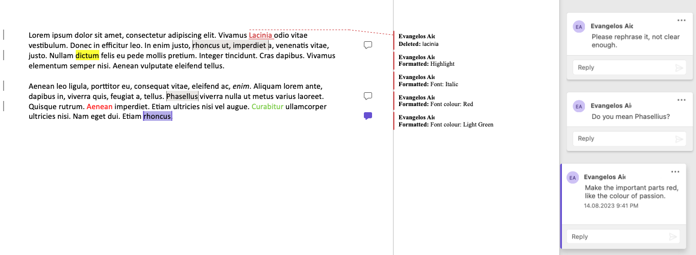
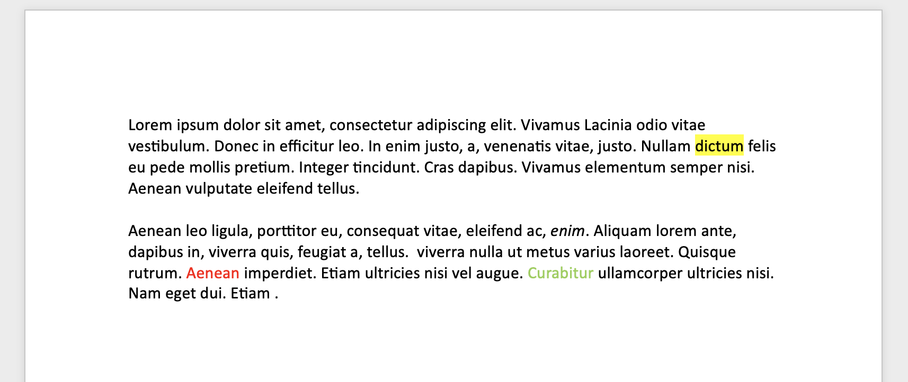

# MS Word Refiner

`MS Word Refiner` is a utility tool designed to automatically remove changes and comments from a `docx` document. Ideal for those looking to share clean, comment-free Word documents, especially when the native Word functionalities are not available.

## Usage

You can download the pre-compiled binaries from the release section, or alternatively, build it yourself. This tool was built using Go version 1.20, leveraging its built-in support for "slices".

## Sample

See how `MS Word Refiner` transforms a cluttered document into a neat one:

**Before:**  



``` bash
./mswordrefiner ~/Downloads/sample-word.docx
Done!
New file: /Users/test/Downloads/sample-word_c.docx
```

**After:**  


## Motivation

The motivation behind developing this tool came from personal experience. On numerous occasions, I had Word documents with multiple comments and changes that I wanted to share as clean PDFs with clients. While MS Word on Windows offers a convenient one-click option to inspect and remove such annotations, this feature is absent on macOS.

## How Does It Work?

At its core, the tool modifies the underlying XML of the `docx` file.

A `docx` file is essentially a zip format containing all the necessary information about the Word document.

Here's a step-by-step rundown of the refining process:

1. Load the `.docx` file into memory.
2. Decompress its content.
3. Alter the `document.xml` file to remove references to comments.
4. Update the `document.xml` file to confirm changes and remove deletions.
5. Delete all XML files associated with comments.
6. Turn off change tracking in the `settings.xml` file.
7. Save the refined file with a `_c` suffix in the same location.
